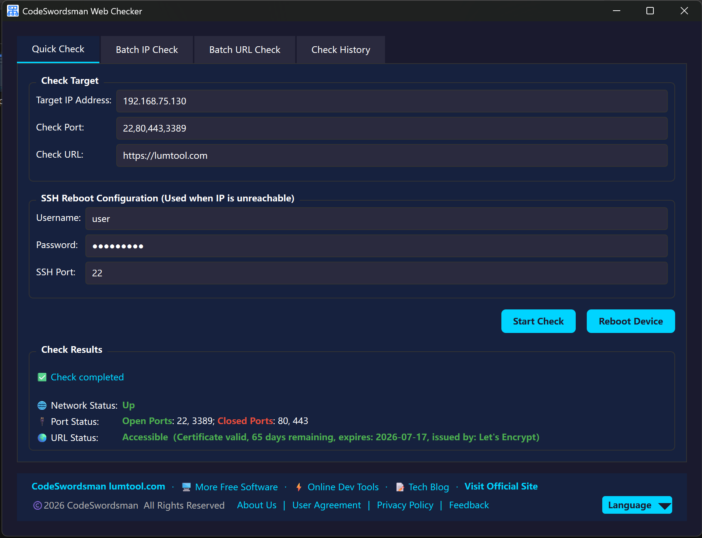
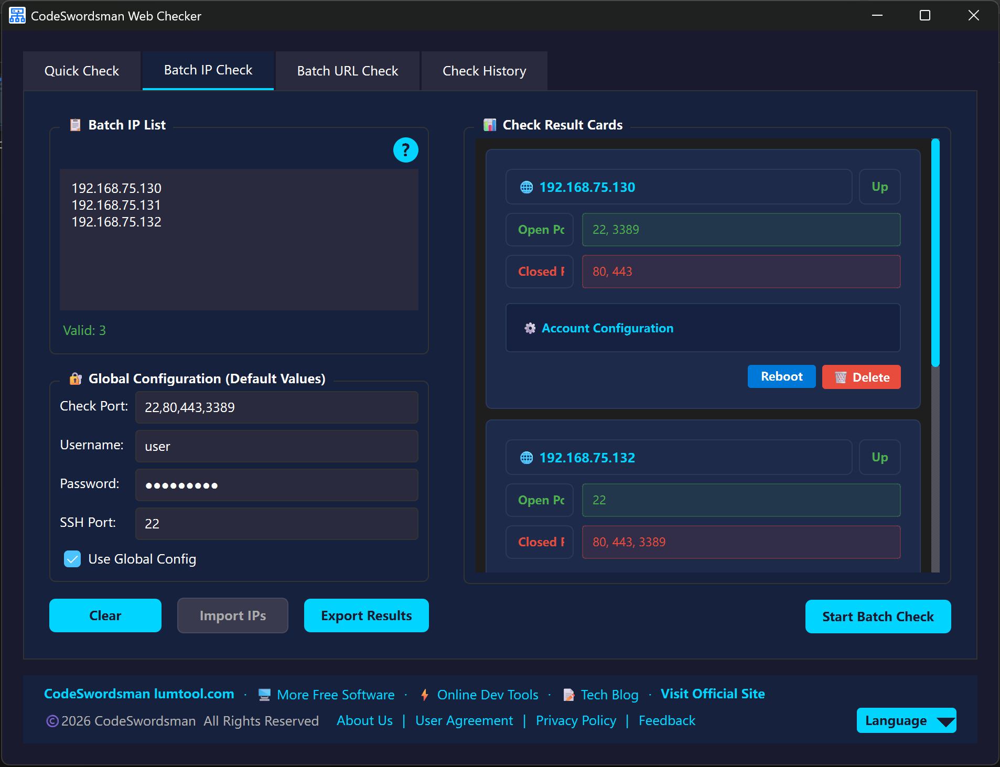
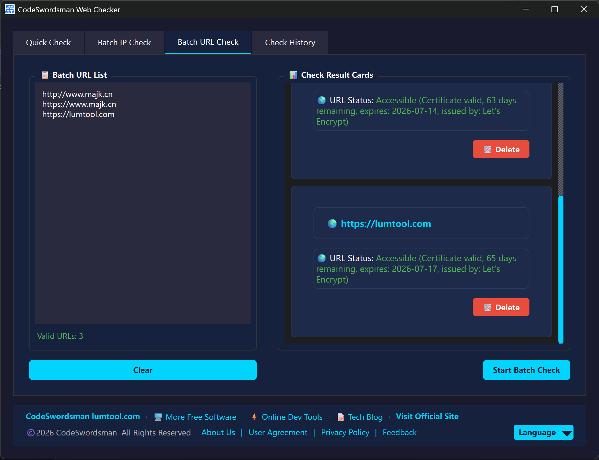
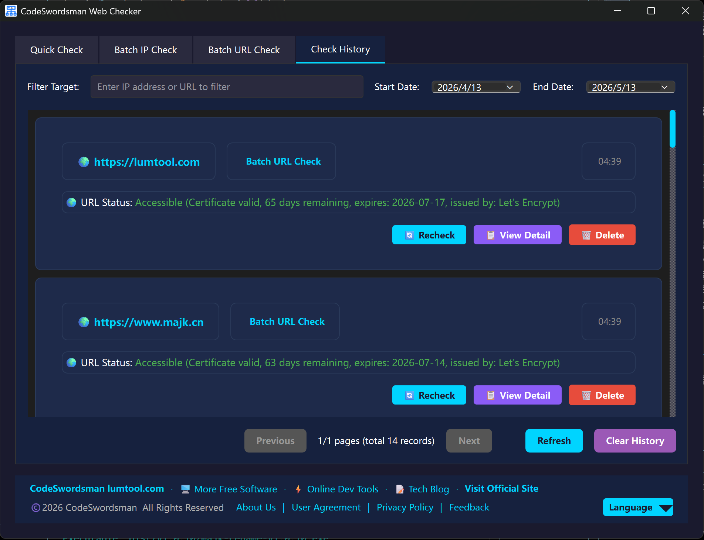
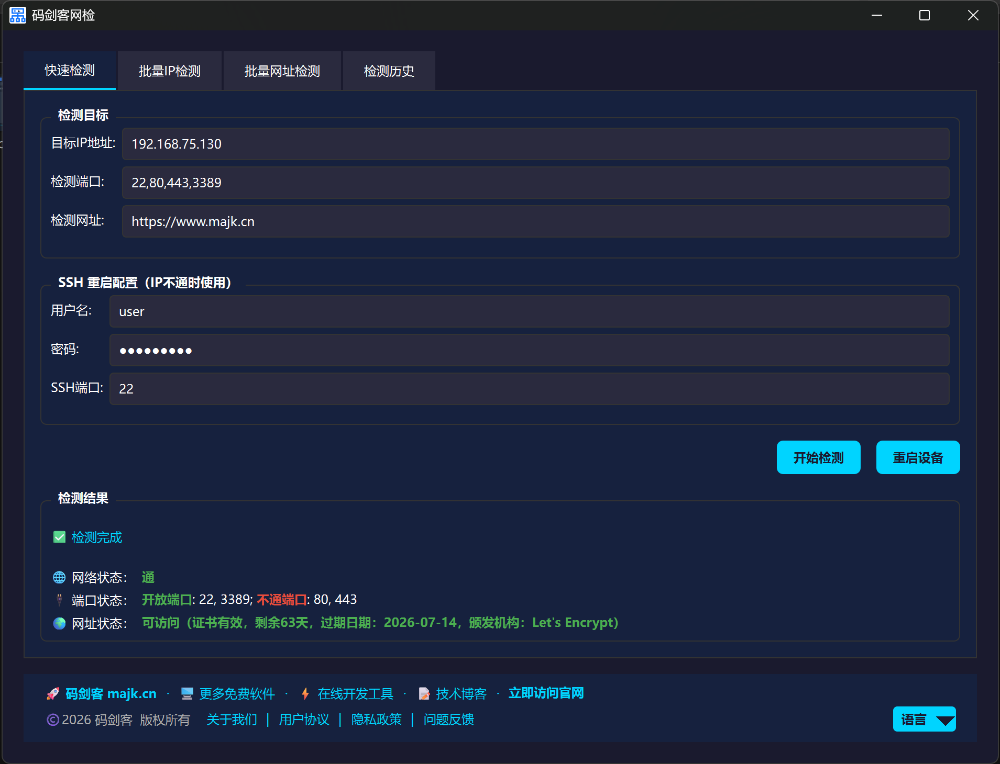
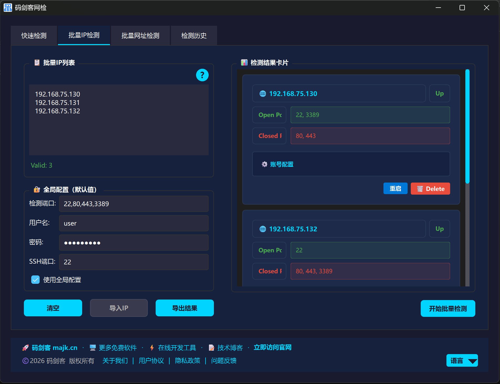
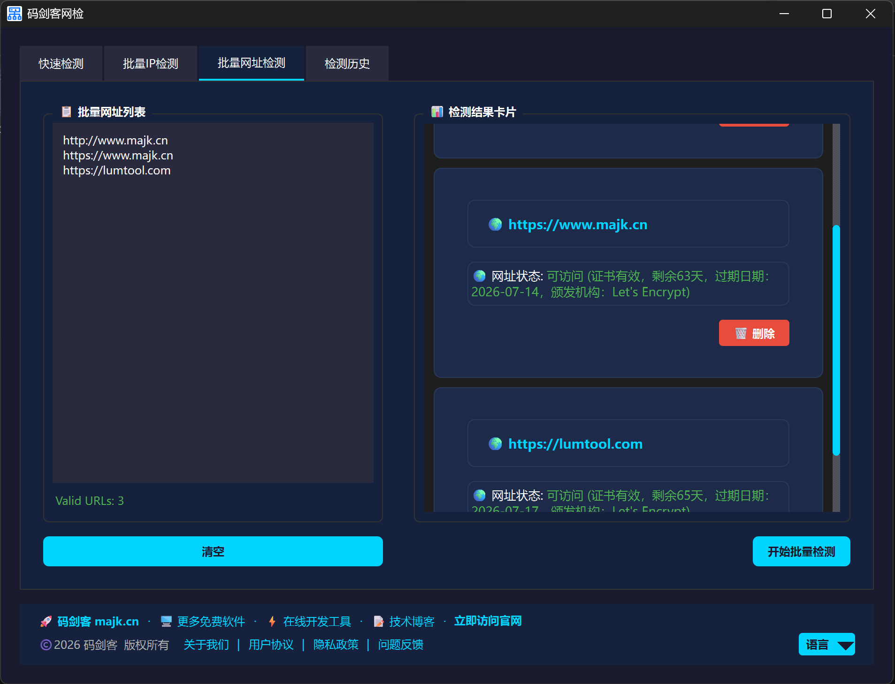
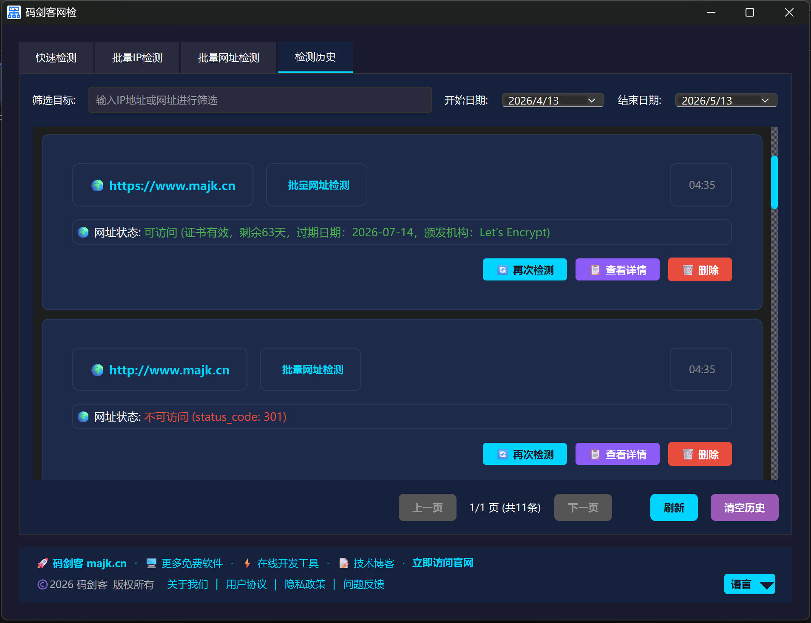

# 码剑客网检 / CodeSwordsman Network Checker

Free, powerful, and easy-to-use network checker for everyone.

***

## 📖 About Us / 关于我们

 

致力于开发优秀的免费软件工具，深耕实用型工具领域，秉持开源、高效、便捷的理念，为全球用户提供简洁易用、功能靠谱的使用体验，助力用户提升效率、简化操作。

# We are dedicated to developing excellent free software tools. Focusing on the field of practical utilities, we adhere to the concepts of open source, efficiency and convenience, providing users with a user-friendly and reliable experience that helps improve efficiency and simplify operations.

致力于开发优秀的免费软件工具，深耕实用型工具领域，秉持高效、便捷的理念，为全球用户提供简洁易用、功能靠谱的使用体验，助力用户提升效率、简化操作。
We are committed to developing excellent free software tools, focusing on the field of practical utilities. Upholding the principles of efficiency and convenience, we provide users worldwide with a simple, easy-to-use and reliable experience, helping them improve efficiency and simplify operations.
中文官网：<https://www.majk.cn>
English Website：<https://lumtool.com>

> > > > > > > bb6c66aa26742864e803b73087f22e6c577121a6

***

## ✨ Features / 功能特性

## 产品功能 / Features

- **快速检测 / Quick Check**：单 IP 检测，支持网络状态、端口状态、网址状态检查。  
  Single IP detection, supporting checks for network status, port status, and website status.

- **批量检测 / Batch Detection**：多 IP、多网址批量检测，支持导入 IP 列表文件。  
  Bulk checks for multiple IPs and URLs, with support for importing IP list files.

- **SSH 重启 / SSH Reboot**：设备不通时可通过 SSH 远程重启设备。  
  Remotely restart devices via SSH when they are unresponsive.

- **多语言支持 / Multi-language Support**：内置中文与英文界面。  
  Built-in Chinese and English interface options.

- **结果导出 / Result Export**：支持将检测结果导出为文本文件。  
  Export detection results as text files.

- **用户友好 / User-Friendly Design**：界面直观简洁，操作简单便捷。  
  Intuitive, clean interface with simple and easy operations.

- **SSL 证书检测 / SSL Certificate Check**：支持快速 SSL 证书有效期检测。  
  Quickly verify SSL certificate validity and expiration dates.

### 🖼️ Software Interface / 软件界面

#### English Interface

|           Main Interface           |           Quick Check           |
| :--------------------------------: | :-----------------------------: |
|  |  |

|           Batch Check           |           Result Export           |
| :-----------------------------: | :-------------------------------: |
|  |  |

#### 中文界面

|           主界面           |           快速检测           |
| :---------------------: | :----------------------: |
|  |  |

|           批量检测           |           结果导出           |
| :----------------------: | :----------------------: |
|  |  |

***

## 🚀 How to Use / 使用步骤

### English Version

1. Download and open the software
2. For quick check: Enter IP address, select port, and enter URL (optional)
3. For batch check: Enter IP addresses (one per line) or import from file
4. For SSL certificate check: Enter domain name to verify certificate validity
5. Click "Check" to start detection
6. View results in real-time (network status, port status, website status)
7. Export results to text file if needed
8. Use SSH reboot function for unreachable devices

### 中文版

1. 下载并打开软件
2. 快速检测：输入IP地址，选择端口，输入网址（可选）
3. 批量检测：输入IP地址（每行一个）或从文件导入
4. SSL证书检测：输入域名验证证书有效期
5. 点击"检测"开始检测
6. 实时查看结果（网络状态、端口状态、网址状态）
7. 如需导出结果为文本文件
8. 对不通的设备使用SSH重启功能

### 📺 Demo Video / 演示视频

- English: [CodeSwordsman Network Checker Demo](assets/en/demo.mp4)
- 中文: [码剑客网检工具演示](assets/zh/demo.mp4)

***

## 📦 下载说明 / Download

### 方式一：GitHub 直接下载 / Method 1: Direct Download from GitHub

- 本版本仅支持 Windows x64 系统
  This version only supports Windows x64 system
- 下载后直接双击 `majk-web-check-v1.0.5-win64-Setup.exe` 运行安装，无需额外配置
  Download and double-click `majk-web-check-v1.0.5-win64-Setup.exe` to install, no additional configuration required

### 方式二：微软商店下载 / Method 2: Microsoft Store Download

- 可通过微软商店一键安装，自动更新，安全无捆绑
  One-click installation via Microsoft Store, automatic updates, safe and no bundles
- 下载链接：<https://apps.microsoft.com/detail/9MV1QTQ307GB>
- Download link: <https://apps.microsoft.com/detail/9MV1QTQ307GB>

***

\=======

- 下载链接：<https://apps.microsoft.com/store/detail/XPFNZ3NB114VB1>
- Download link: <https://apps.microsoft.com/store/detail/XPFNZ3NB114VB1>

***

> > > > > > > bb6c66aa26742864e803b73087f22e6c577121a6

## 📜 License / 授权协议

### 核心声明

⚠️ 本软件为**闭源免费软件**，仅开放下载和使用，不公开源代码。

This software is free for personal non-commercial use only.
Commercial use, resale, decompilation, and unauthorized distribution are prohibited.
All rights reserved by CodeSwordsmanDev.

本软件为免费软件，仅供个人非商业使用。
禁止二次分发、倒卖、破解。
软件版权归CodeSwordsmanDev所有。

For more details, please see the [LICENSE](LICENSE) file.

***

## 🚫 Restrictions / 使用限制

- 仅限个人非商业使用，禁止商用、倒卖、破解、二次分发；
- 禁止逆向工程、反编译、修改软件本体。

***

## 🤝 Feedback / 反馈

If you have any questions or suggestions, please submit an Issue on GitHub.

如有问题或建议，欢迎在 GitHub 提交 Issue。

***

## ❓ FAQ

Q: 是否开源源代码？
A: 本软件为闭源免费工具，暂不公开源代码，仅提供可执行安装包供个人非商用使用。

Q: 下载的安装包有病毒吗？
A: 所有安装包均通过 GitHub Releases 官方分发，上架微软应用商店，无捆绑、无广告、无恶意代码，可放心下载。

Q: 如何使用SSH重启功能？
A: 在快速检测或批量检测中，当设备显示为"Down"状态时，输入SSH用户名和密码，然后点击重启按钮即可。

Q: 批量检测支持什么格式的IP列表？
A: 支持每行一个IP地址的文本文件，也支持IP::用户名::密码::端口的格式。

***

## 🔧 System Requirements / 系统要求

- Windows 10/11
- 2GB+ RAM
- 50MB+ free disk space
- Internet connection (for URL checking)

***

## 📞 Contact / 联系我们

- Website: <https://www.majk.cn>
- GitHub: <https://github.com/CodeSwordsmanDev>

***

## 🌟 Acknowledgements / 致谢

感谢所有支持和使用本软件的用户！

Thanks to all users who support and use this software!
